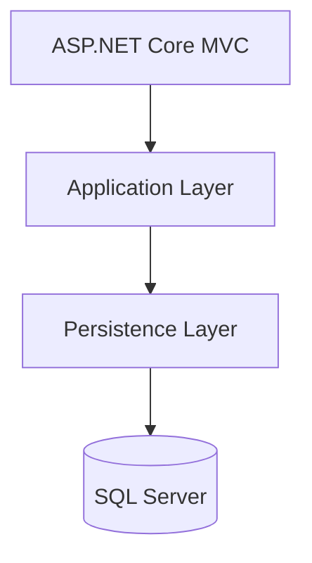

# ImportCost Pro

## Import Management and Landed Cost Calculation System

ImportCost Pro is a web-based application developed with **ASP.NET Core MVC**, **Entity Framework Core**, and **SQL Server**. The system was designed to support import operations by managing master data, import orders, operational expenses, and landed cost calculations.

The project was developed collaboratively by a team of three developers using a layered architecture approach and modern software engineering practices.

---

# Repository

```text
https://github.com/JoelAlBenitez/ImportCost-Pro.git
```

---

# Table of Contents

- [Overview](#overview)
- [Objectives](#objectives)
- [Key Features](#key-features)
- [System Modules](#system-modules)
- [Architecture](#architecture)
- [Project Structure](#project-structure)
- [Technologies Used](#technologies-used)
- [Database](#database)
- [Installation](#installation)
- [Configuration](#configuration)
- [Entity Framework Core Migrations](#entity-framework-core-migrations)
- [Running the Application](#running-the-application)
- [Business Rules Implemented](#business-rules-implemented)
- [Development Team](#development-team)
- [Git Workflow](#git-workflow)
- [Future Improvements](#future-improvements)
- [License](#license)

---

# Overview

ImportCost Pro was created to centralize and automate the management of import operations.

The platform provides functionality for:

- Product management
- Supplier management
- Importer management
- Tariff category administration
- Country management
- Currency management
- Exchange rate administration
- Tax configuration
- Import order management
- Import expense registration
- Landed cost calculation

The solution follows a layered architecture that promotes maintainability, scalability, and separation of concerns.

---

# Objectives

- Manage import-related master data.
- Standardize import registration processes.
- Maintain historical information integrity.
- Support import cost analysis.
- Centralize tax and tariff configurations.
- Calculate landed costs accurately.
- Apply business rules and validations consistently.

---

# Key Features

## Operational & Commercial Management

- Product Maintenance
- Supplier Maintenance
- Importer Maintenance
- Tariff Category Maintenance

## Financial Core

- Country Management
- Currency Management
- Exchange Rate Management
- Tax Configuration

## Import Operations

- Import Order Registration
- Order Details Management
- Import Expense Registration
- Landed Cost Calculation

## Technical Features

- Layered Architecture
- Entity Framework Core
- SQL Server Integration
- Dependency Injection
- Repository Pattern
- MVC Pattern
- Data Annotations Validation
- JavaScript Pagination
- Responsive UI
- Entity Relationships
- Database Migrations

---

# System Modules

| Module | Description |
|----------|----------|
| Products | Product registration and management |
| Suppliers | Supplier administration |
| Importers | Importer administration |
| Tariff Categories | Customs and tax category management |
| Countries | Country administration |
| Currencies | Currency administration |
| Exchange Rates | Exchange rate management |
| Tax Configuration | Tax settings and percentages |
| Import Orders | Import order lifecycle |
| Order Details | Product details within orders |
| Import Expenses | Import-related expenses |
| Landed Cost | Final import cost calculation |

---

# Architecture

The project follows a Layered Architecture approach.

## Layers

### Presentation Layer

Responsible for:

- MVC Controllers
- Razor Views
- User Interaction
- Client-side JavaScript

### Application Layer

Responsible for:

- Business Logic
- DTOs
- ViewModels
- Services

### Persistence Layer

Responsible for:

- Entity Framework Core
- Repositories
- Database Context
- Entity Configurations
- Migrations

---

# Architecture Diagram



---

# Project Structure

```text
ImportCost-Pro
│
├── ImportCost
│   ├── Controllers
│   ├── Views
│   ├── wwwroot
│
├── Application
│   ├── DTOs
│   ├── Services
│   ├── ViewModel
│   └── ServicesRegistration
│
├── Persistence
│   ├── Context
│   ├── Entities
│   ├── Repositories
│   ├── Configurations
│   ├── Migrations
│   └── ServiceRegistration
│
└── ImportCost-Pro.sln
```

---

# Technologies Used

| Technology | Purpose |
|------------|----------|
| .NET 9 | Development Platform |
| ASP.NET Core MVC | Web Framework |
| Entity Framework Core | ORM |
| SQL Server | Database Engine |
| Razor Views | UI Rendering |
| JavaScript | Client-side Features |
| Bootstrap | UI Styling |
| LINQ | Data Queries |
| Dependency Injection | Service Management |
| Git | Version Control |
| GitHub | Source Control Hosting |

---

# Database

## Main Entities

### Operational Commercial

- Products
- Suppliers
- Importers
- Tariff Categories

### Financial Core

- Countries
- Currencies
- Exchange Rates
- Tax Configuration

### Import Operations

- Importation Orders
- Importation Order Details
- Importation Expenses
- Landed Cost Summary
- Landed Cost Detail

---

# Installation

## Clone Repository

```bash
git clone https://github.com/JoelAlBenitez/ImportCost-Pro.git
```

## Navigate to Project

```bash
cd ImportCost-Pro
```

## Restore Dependencies

```bash
dotnet restore
```

## Build Project

```bash
dotnet build
```

---

# Configuration

## Connection String

Open:

```text
ImportCost/appsettings.json
```

Configure:

```json
{
  "ConnectionStrings": {
    "DefaultConnection": "Server=YOUR_SERVER;Database=ImportCostDB;Trusted_Connection=True;TrustServerCertificate=True"
  }
}
```

Example:

```json
{
  "ConnectionStrings": {
    "DefaultConnection": "Server=localhost;Database=ImportCostDB;Trusted_Connection=True;TrustServerCertificate=True"
  }
}
```

---

# Entity Framework Core Migrations

## Install EF Core Tools

```bash
dotnet tool install --global dotnet-ef
```

Verify installation:

```bash
dotnet ef --version
```

## Create Database

Apply migrations:

```bash
dotnet ef database update \
--project Persistence \
--startup-project ImportCost
```

## Create New Migration

```bash
dotnet ef migrations add MigrationName \
--project Persistence \
--startup-project ImportCost
```

---

# Running the Application

Run the project:

```bash
dotnet run --project ImportCost
```

Or:

```bash
cd ImportCost
dotnet run
```

---

# Business Rules Implemented

The application implements multiple business rules extracted from the project requirements.

## Products

- Unique product code validation.
- Active/inactive status management.
- Historical integrity preservation.
- Weight and volume validations.
- Tariff category validation.

## Suppliers

- Active supplier filtering.
- Country validation.
- Currency validation.
- Historical data protection.

## Importers

- Unique tax identification validation.
- Import order relationship validation.
- Historical consistency rules.

## Tariff Categories

- Unique tariff code validation.
- Tax applicability rules.
- Selective tax validations.
- Historical calculation protection.

## Import Orders

- Product association.
- Supplier association.
- Importer association.
- Expense registration.
- Landed cost calculations.

---

# Development Team

## Contributors

| Contributor | Responsibilities |
|------------|------------------|
| Joel Benitez | Products, Importers, Suppliers, Tariff Categories |
| Sebastian Peguero | Landed Cost, Import Orders, Order Details, Import Operations |
| Adrian (Adrixn23) | Countries, Currencies, Exchange Rates, Tax Configuration |

---

# Team Profiles

| Developer | GitHub |
|------------|---------|
| Joel Benitez | https://github.com/JoelAlBenitez |
| Sebastian Peguero | https://github.com/SebasPeguero |
| Adrian | https://github.com/Adrixn23 |

---

# Git Workflow

The project was developed using a collaborative Git workflow.

## Branches

```text
main
development
feature/*
```

Development process:

1. Create feature branch.
2. Implement functionality.
3. Commit changes.
4. Merge into development.
5. Validate integration.
6. Merge into main.

---

# Academic Scope

This project was developed as part of an academic software engineering initiative focused on:

- Requirements Analysis
- Software Design
- Layered Architecture
- Database Modeling
- Entity Framework Core
- Team Collaboration
- Version Control
- Business Rule Implementation

---

# Future Improvements

Potential enhancements include:

- Authentication and Authorization
- Role-Based Access Control
- Reporting Module
- Dashboard Analytics
- PDF Export
- Excel Export
- Audit Logs
- Unit Testing
- Integration Testing
- Docker Support
- CI/CD Pipelines

---

# License

This project was developed for educational and academic purposes.

All rights belong to their respective authors and contributors.

---

# Acknowledgements

Special thanks to all contributors involved in the analysis, design, development, testing, and implementation of the ImportCost Pro system.
